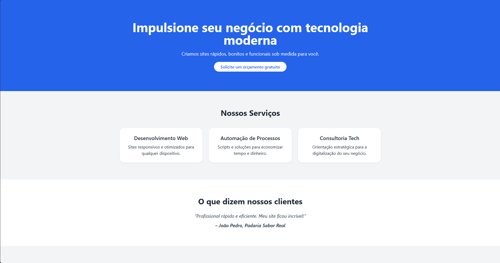
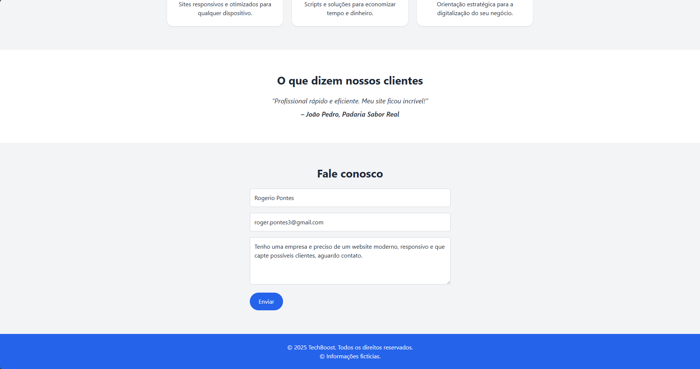
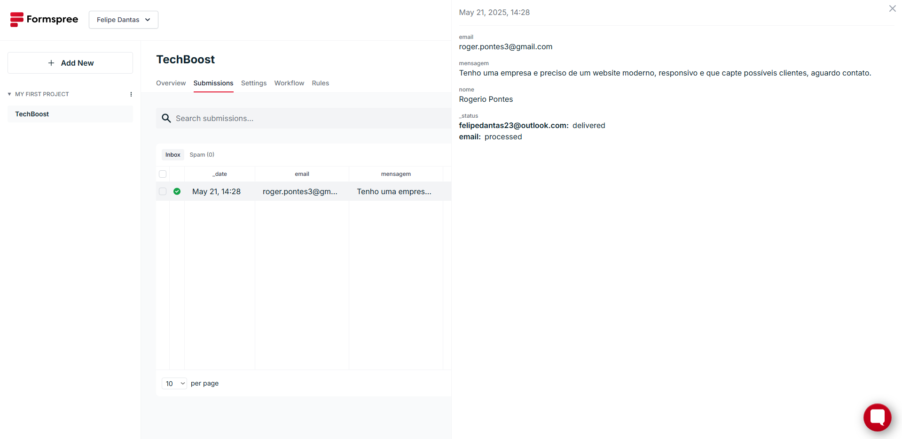

# TechBoost - Landing Page

Uma landing page moderna e responsiva para promover serviços de tecnologia. Construída com **HTML5** e **TailwindCSS**, otimizada para mobile e com formulário funcional via [Formspree](https://formspree.io).

## 📸 Preview




## 🚀 Funcionalidades

- Layout responsivo (mobile-first)
- Design limpo e profissional
- Sessão de serviços com cards
- Depoimento de cliente
- Formulário de contato funcional (Formspree)
- Fácil de personalizar e expandir

## 💡 Tecnologias

- HTML5
- [TailwindCSS CDN](https://tailwindcss.com/docs/installation/play-cdn)

🔗 **Veja ao vivo:**  
👉 [https://techboost-landing.vercel.app](https://techboost-landing.vercel.app)

## 🛠 Como usar

1. Clone este repositório:
   ```bash
   git clone https://github.com/seu-usuario/techboost-landing.git
